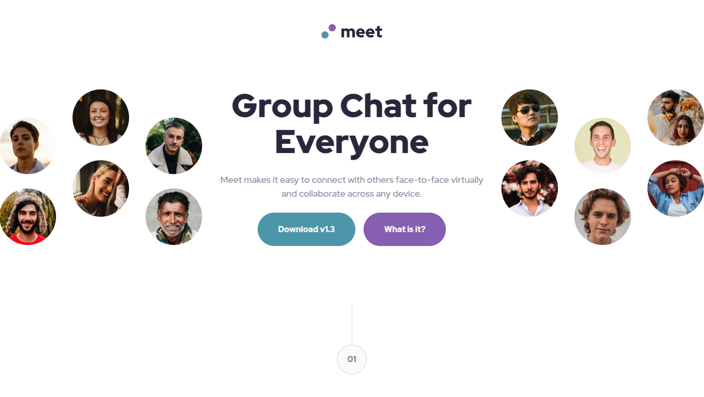

# Frontend Mentor - Meet landing page solution

This is a solution to the [Meet landing page challenge on Frontend Mentor](https://www.frontendmentor.io/challenges/meet-landing-page-rbTDS6OUR). Frontend Mentor challenges help you improve your coding skills by building realistic projects.

## Table of contents

- [Overview](#overview)
  - [The challenge](#the-challenge)
  - [Screenshot](#screenshot)
  - [Links](#links)
- [My process](#my-process)
  - [Built with](#built-with)
  - [What I learned](#what-i-learned)
- [Author](#author)

**Note: Delete this note and update the table of contents based on what sections you keep.**

## Overview

### The challenge

Users should be able to:

- View the optimal layout depending on their device's screen size
- See hover states for interactive elements

### Screenshot



### Links

- Solution URL: [Code Repository](https://github.com/Melbita/meet-landing-page)
- Live Site URL: [Live site](https://melbita.github.io/meet-landing-page/)

## My process

### Built with

- Semantic HTML5 markup
- CSS custom properties
- Flexbox
- CSS Grid
- Mobile-first workflow

### What I learned

I think the challenge was working with background images and applying color to them. Then, several adjustments changed the arrangement of elements at different browser breakpoints.

```css
background: linear-gradient(
    0deg,
    rgba(var(--color-cyan-600-rgb), 0.9),
    rgba(var(--color-cyan-600-rgb), 0.9)
  ), url(./assets/mobile/image-footer.jpg) no-repeat;
background-size: 100% 100%;
```

## Author

- Frontend Mentor - [@melbita](https://www.frontendmentor.io/profile/melbita)
